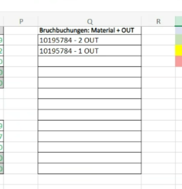

| :bowtie: `:bowtie:` | :smile: `:smile:` | :laughing: `:laughing:` |
### MD EDIT <https://www.heise.de/mac-and-i/downloads/65/1/1/6/7/1/0/3/Markdown-CheatSheet-Deutsch.pdf>
# Kurzbeschreibung
Auswertung und grafische Darstellung der Logistikprozesse am Standort sowie die Möglichkeit der Datenerfassung (z.B. Fehlverladungen)
# ToDo 

Wenn LT22 Parser steht 

# BAT FARBEN: ''' BAT Colurs
#0e2b63 darkBlue
#004f9f MidBlue
#00b1eb LightBlue
#ef7d00 Orange
#ffbb00 Yellow
#ffaf47 Green
#afca0b lightGreen
#5a328a Purple
#e72582 Pink
'''

## Pip requirements.txt
pip install pipreqs
pipreqs /path/to/project

# FAQ LINKS

streamlit to exe <https://discuss.streamlit.io/t/streamlit-deployment-as-an-executable-file-exe-for-windows-macos-and-android/6812?page=2>
streamlit to exe <https://discuss.streamlit.io/t/streamlit-wasm-electron-desktop-app/31655>
